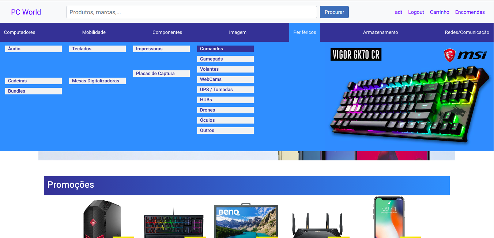
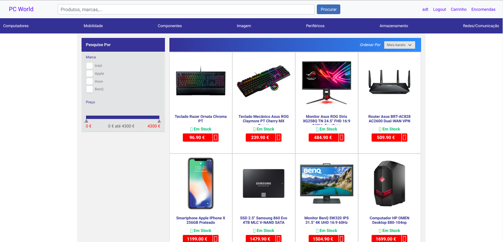
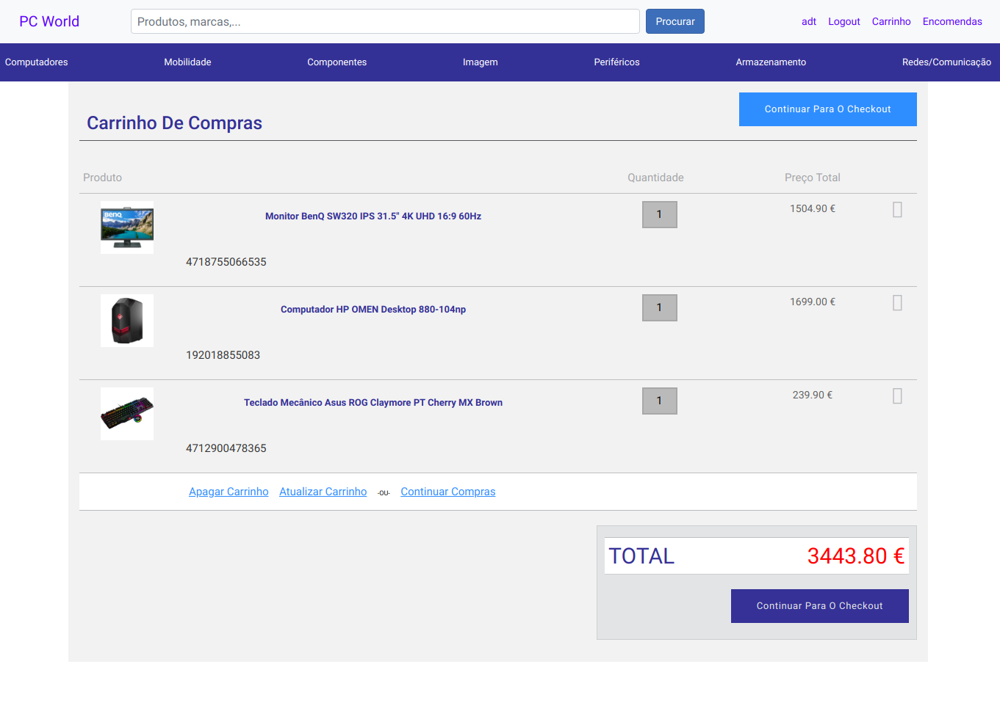
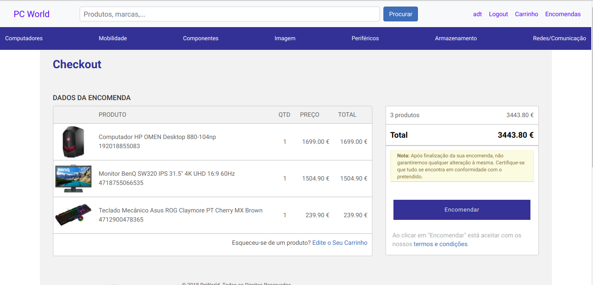
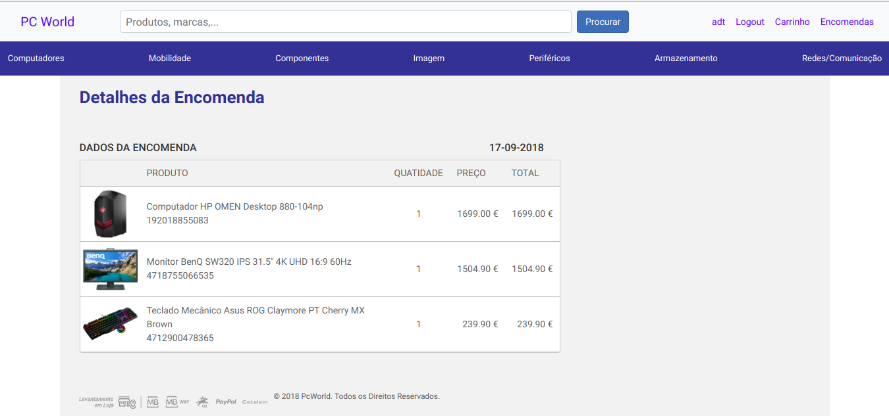

# Online Store

An online store of computer products developed with the Django framework as part of my master's thesis `Secure Web Applications in Django`.

 Some features:

* **Product search**

* **Sorting and filtering of search results**

* **Shopping cart management**

* **Order history and placement**

* **Making payments**

